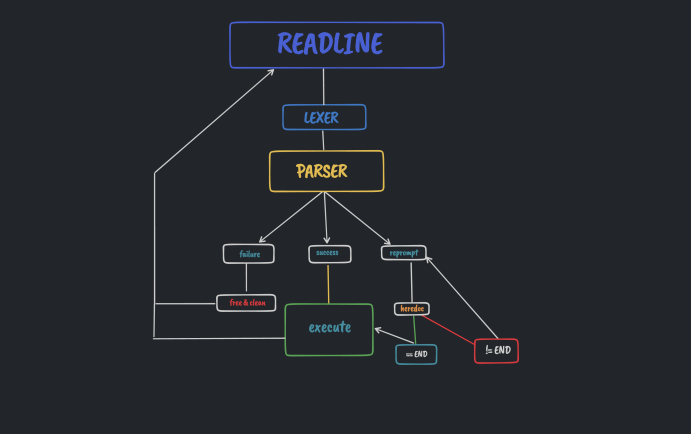

# 
███╗░░░███╗██╗███╗░░██╗██╗░██████╗██╗░░██╗███████╗██╗░░░░░██╗░░░░░
████╗░████║██║████╗░██║██║██╔════╝██║░░██║██╔════╝██║░░░░░██║░░░░░
██╔████╔██║██║██╔██╗██║██║╚█████╗░███████║█████╗░░██║░░░░░██║░░░░░
██║╚██╔╝██║██║██║╚████║██║░╚═══██╗██╔══██║██╔══╝░░██║░░░░░██║░░░░░
██║░╚═╝░██║██║██║░╚███║██║██████╔╝██║░░██║███████╗███████╗███████╗
╚═╝░░░░░╚═╝╚═╝╚═╝░░╚══╝╚═╝╚═════╝░╚═╝░░╚═╝╚══════╝╚══════╝╚══════╝

## subject

the subject is simply to create a minishell with some builtin commands

## implemintation

to impleminte a minishell first i need to <b>parse</b> the command and put it in a struct so that in the <b>executing</b> 
part i can just take the commands and execute them



in the order to do this i separated the project to two parts 

### parsing

in the parsing part i took the input and splited it into tokens 

```
typedef struct s_token
{
	enum {
		TOKEN_END,
		TOKEN_WORD,
		TOKEN_OLD_THAN,
		TOKEN_LESS_THAN,
		TOKEN_LESS_LESS,
		TOKEN_GREAT_GREAT,
		TOKEN_PIPE,
		TOKEN_AND_AND,
		TOKEN_PIPE_PIPE,
		TOKEN_PARENTHESES,
	}	e_type;
	char	*value;
}	t_token;
```

the <b>e_type</b> is an enum that return the index of the token assigned to it </br>
the <b>value</b> is the pyload of this token 

this porcess is called the <b>lexer</b>

the iterate over the token and put every token in the cmd struct which hold all the necessary info to execute this command

```
typedef struct s_cmd {
	char	*str;
	char	*path;
	char	*output;
	char	*input;
	char	**args;
	int		heredoc;
	int		append;
	int		doc[2];
	int		pipe;
	int		and;
	int		or;
	int		p[2];
	int		pid;
	int		err;
}	t_cmd;
```

<b>path</b>: is the path of the command </br>
<b>output</b>: hold the output file name </br>
<b>input</b>: holds the input file name </br>
<b>args</b>: is an two dimentional arr that holds all the arguments of this commnad including the command itslef </br>
<b>heredoc</b>: 1 if i should read from the standard input and 0 if not</br>
<b>append</b>: 1 if i souuld add the result of this command to the output file and 0 if not </br>
<b>doc</b>: the pipe where the heredoc stores what his reading </br>
<b>pipe, and, or</b>: set 1 for the variable that seprates this command and the next command and 0 in the remained tow </br>
<b>p</b>: for the pipe redirection </br>
<b>err</b>: 1 if an error happen during exection part </br>
